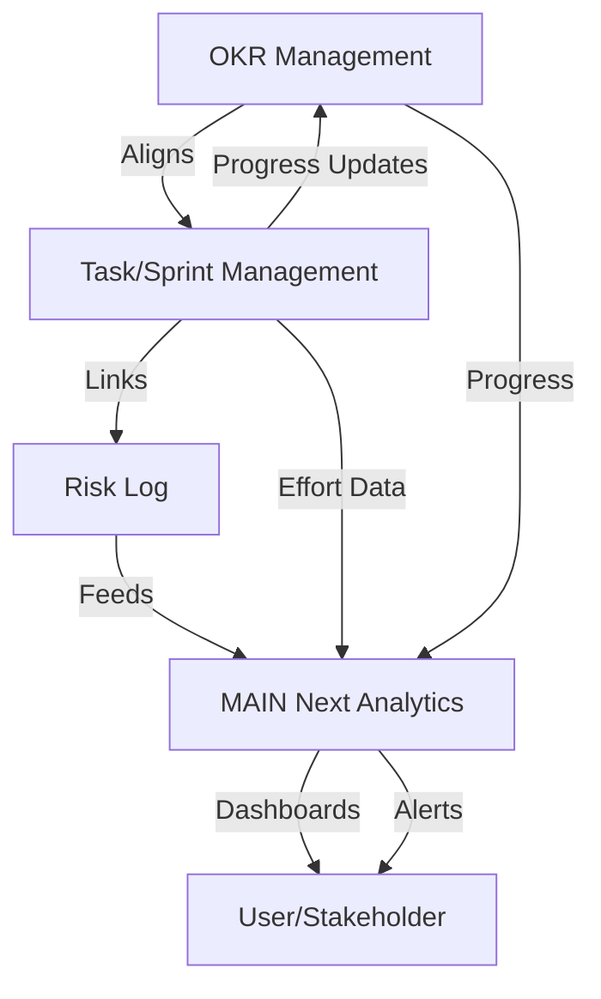

# MAIN Next-Aligned Feature Plan

This document outlines a prioritized plan for adding MAIN Next methodology-aligned functionality to the application, supporting project planning and delivery as described in the MAIN Next book.

---

## 1. Business Goal & OKR Tracking

**Objective:** Enable teams to define, align, and continuously track business goals and OKRs at project, sprint, and feature levels.

### Key Features
- **OKR Management Module**
  - Create, edit, and archive Objectives and Key Results at project, team, or sprint level.
  - Assign owners and statuses to each OKR.
  - Link OKRs to specific tasks, sprints, or features.
- **OKR Alignment Dashboard**
  - Visualize how current work (tasks, sprints, features) maps to active OKRs.
  - Show progress bars for each Key Result, updated in real time from task/sprint completion and analytics.
  - Highlight misaligned or orphaned work items (not linked to any OKR).
- **Continuous Alignment Alerts**
  - Notify users when work drifts from OKRs (e.g., tasks completed that don’t contribute to any active Key Result).
  - Suggest backlog grooming or sprint re-planning if alignment drops below a threshold.

### Example UI Elements
- OKR List & Detail Views
- “Align to OKR” button in task/sprint editors
- OKR progress widgets on project/sprint dashboards

---

## 2. Risk Management (with AI Risk Log)

**Objective:** Provide structured risk identification, tracking, and mitigation, including AI-specific risks as per MAIN Next.

### Key Features
- **Risk Log Module**
  - Add, categorize, and prioritize risks (e.g., Security, Ethical, Compliance, Delivery, AI-specific).
  - Track probability, impact, mitigation actions, and ownership.
  - Link risks to OKRs, tasks, sprints, or resources.
- **AI Risk Management**
  - Special fields for AI-related risks (e.g., model drift, bias, data leakage, over-reliance on AI).
  - Templates for common AI risks (pre-filled suggestions based on MAIN Next).
- **Risk Heatmap & Alerts**
  - Visualize risk exposure across the project (heatmap by probability/impact).
  - Automated reminders for overdue mitigations or high-severity risks.
  - Integration with analytics to flag emerging risks (e.g., spike in AI-generated defects).

### Example UI Elements
- Risk Log Table & Detail View
- Risk Heatmap Dashboard Widget
- “Add Risk” button in task/feature/OKR editors

---

## 3. Advanced MAIN Next Analytics

**Objective:** Provide actionable insights and reporting on AI-human collaboration, productivity, quality, and business impact, as per MAIN Next metrics.

### Key Features
- **AI vs. Human Effort Tracking**
  - Track and visualize the proportion of work done by AI, humans, or hybrid (per task, sprint, project).
  - Show trends over time and by functional area.
- **Overhead & Efficiency Metrics**
  - Measure AI setup/supervision overhead vs. time saved.
  - Calculate and display MAIN Next “Efficiency Multiplier” and “Overhead Coefficient” (see book’s logistic models).
- **Quality & Risk Analytics**
  - Defect density, test coverage, and bug-fix lead time for AI-generated vs. human-generated code/tasks.
  - Correlate risk log entries with actual incidents or quality drops.
- **Business Impact Reporting**
  - Link OKR progress to business outcomes (e.g., user engagement, revenue, NPS).
  - Real-time dashboards for executives, POs, and team leads.

### Example UI Elements
- Analytics Dashboard (with MAIN Next metrics)
- Drill-down charts (AI vs. human effort, efficiency over time, risk trends)
- Exportable reports for retrospectives and leadership reviews

---

## 4. Integration & Workflow

- **Linking Across Modules:** Tasks, sprints, resources, and risks can all be linked to OKRs and to each other for traceability.
- **Role-Based Access:** Ensure only authorized users can edit OKRs, risks, or analytics settings.
- **Templates & Best Practices:** Provide MAIN Next-aligned templates for OKRs, risk logs, and analytics dashboards.

---

## 5. Example System Flow (Mermaid Diagram)

---

## Next Steps

1. Review and confirm this plan as the basis for implementation.
2. Proceed to implementation in the preferred mode.