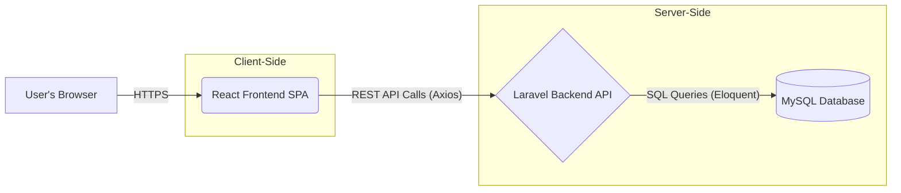

# Resource Planning & Task Assignment Tool

This project is a web application designed for resource planning and task assignment, helping manage resources (human, AI tools, or combined), skills, domains, tasks, sprints, and assignments effectively. It includes features for suggesting resource assignments based on skill/domain fit and current load.

## Technology Stack

*   **Frontend:** React, Ant Design (UI Components), Zustand (State Management), React Router (Routing), Axios (HTTP Client)
*   **Backend:** PHP/Laravel Framework
*   **Database:** MySQL

## Architecture

The application follows a standard client-server architecture:

*   **Frontend (React Single-Page Application):** Built with React and Vite, using Ant Design for UI components, Zustand for global state management, and React Router for client-side navigation. It interacts with the backend via REST API calls.
    *   **Key Directories:**
        *   `src/components`: Reusable UI elements.
        *   `src/features`: Components specific to application features (e.g., Resource Hub, Task Backlog).
        *   `src/hooks`: Custom React hooks.
        *   `src/lib`: Utilities, API client configuration (Axios).
        *   `src/pages`: Top-level page components.
        *   `src/store`: Zustand state management stores.
        *   `src/routes`: Routing configuration.
*   **Backend (Laravel REST API):** A PHP/Laravel application serving as a RESTful API. It handles business logic, data validation, authentication (using Laravel Sanctum/Passport), and database interactions (using Eloquent ORM).
    *   Follows standard Laravel MVC structure (`app/Http/Controllers`, `app/Models`, `routes/api.php`).
    *   Provides endpoints for managing resources, tasks, skills, domains, sprints, assignments, and user authentication.
    *   Includes logic for calculating resource assignment suggestions based on fit scores and load.
*   **Database (MySQL):** Stores all application data, including users, resources, tasks, skills, domains, sprints, and their relationships.

### Communication Model

The frontend communicates exclusively with the backend API over HTTPS using REST principles. The backend interacts with the MySQL database.



## Deployment Instructions

These instructions assume deployment to a shared hosting environment or similar setup with Apache/Nginx, PHP, and MySQL.

### Backend (Laravel)

1.  **Clone Repository:** Clone the project repository to your server.
    ```bash
    git clone <your-repository-url>
    cd <project-directory>/backend
    ```
2.  **Install Dependencies:**
    ```bash
    composer install --optimize-autoloader --no-dev
    ```
3.  **Configure Environment:**
    *   Copy the example environment file: `cp .env.example .env`
    *   Edit the `.env` file with your specific configuration:
        *   `APP_NAME`, `APP_ENV` (set to `production`), `APP_KEY` (generate using `php artisan key:generate`), `APP_DEBUG` (set to `false`), `APP_URL`
        *   Database connection details (`DB_CONNECTION`, `DB_HOST`, `DB_PORT`, `DB_DATABASE`, `DB_USERNAME`, `DB_PASSWORD`)
        *   Any other necessary service keys or configurations.
4.  **Run Migrations & Seeders:**
    ```bash
    php artisan migrate --seed --force # Use --force in production to bypass confirmation
    ```
5.  **Storage Link:**
    ```bash
    php artisan storage:link
    ```
6.  **Optimize:**
    ```bash
    php artisan config:cache
    php artisan route:cache
    php artisan view:cache
    ```
7.  **File Permissions:** Ensure the web server has the necessary write permissions for the `storage` and `bootstrap/cache` directories. Consult Laravel documentation for specific permission requirements.
8.  **Web Server Configuration:**
    *   Configure your web server (Apache/Nginx) to point the domain or subdomain's document root to the `public` directory of your Laravel installation (`<project-directory>/backend/public`).
    *   **Apache:** Ensure `mod_rewrite` is enabled and the `.htaccess` file provided by Laravel in the `public` directory is respected (usually requires `AllowOverride All` in your Apache configuration for the directory).
    *   **Nginx:** Use a configuration similar to the one provided in the Laravel deployment documentation, ensuring requests are directed to `index.php`. Example snippet:
        ```nginx
        location / {
            try_files $uri $uri/ /index.php?$query_string;
        }
        ```

### Frontend (React)

1.  **Navigate to Frontend Directory:**
    ```bash
    cd ../frontend # Assuming you are in the backend directory
    # Or cd <project-directory>/frontend
    ```
2.  **Install Dependencies:**
    ```bash
    npm install
    ```
3.  **Configure Environment (if applicable):**
    *   Check if there are environment variables needed for the frontend build (e.g., `VITE_API_BASE_URL`). If using Vite, these might be in `.env` or `.env.production`. Ensure the API base URL points to your deployed backend API.
4.  **Build Production Assets:**
    ```bash
    npm run build
    ```
    This will create a `dist` (or `build`) folder containing the static assets.
5.  **Upload Assets:** Upload the *contents* of the `dist` (or `build`) folder to the directory configured to serve your frontend application (e.g., the document root for the frontend's domain/subdomain, or a subfolder).
6.  **Web Server Configuration (for Client-Side Routing):**
    *   Configure your web server to handle client-side routing. All requests to non-asset paths should serve the `index.html` file from the build output.
    *   **Apache:** Using `mod_rewrite` in an `.htaccess` file within the frontend's serving directory:
        ```apache
        <IfModule mod_rewrite.c>
          RewriteEngine On
          RewriteBase /
          RewriteRule ^index\.html$ - [L]
          RewriteCond %{REQUEST_FILENAME} !-f
          RewriteCond %{REQUEST_FILENAME} !-d
          RewriteCond %{REQUEST_FILENAME} !-l
          RewriteRule . /index.html [L]
        </IfModule>
        ```
    *   **Nginx:** Update the `location /` block for the frontend server:
        ```nginx
        location / {
            try_files $uri $uri/ /index.html;
        }
        ```

### Environment Variables & Security

*   Ensure sensitive information (database passwords, API keys) is stored securely in environment variables (`.env` file for backend) and *not* committed to version control.
*   Configure appropriate file permissions on the server.
*   Keep dependencies updated.